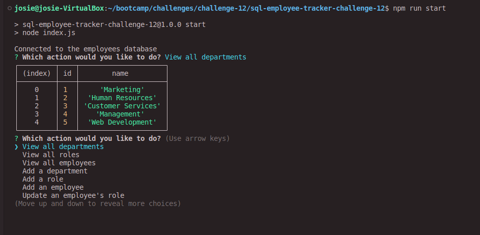

# SQL Employee Tracker

## Description
This node application uses the inquirer node package and SQL to provide a prompt to users seeking to manage an employee database in the command line. Users can perform management tasks for departments, roles, and employees such as viewing, adding, and updating employee roles. The prompts trigger SQL queries, allowing for easy oversight of the employee database.

### Languages and Technologies
JavaScript, Node, Express, Inquirer, MySQL

## Table of Contents
- [Installation](#installation)
- [Usage](#usage)
- [Screenshot](#screenshot)
- [Link to Video Walkthrough](#link-to-video-walkthrough)

## Installation
- Clone git repository.
- Type nym i or npm install in terminal to install necessary dependencies.
- Update connection with your SQL credentials. This can be found in line 10 and line 12 of the index.js file.

## Usage
- To use this generator, first follow the installation steps.
- To begin, connect and initialize the database in the schema.sql file. Seeds can be found in seeds.sql if you would like an employee database to test functionality, or you may add your own data.
- Type npm run start in the terminal. Select an action and if given further prompts, fill in necessary inputs.

## Screenshot

## Link to Video Walkthrough

[Video Walkthrough](https://drive.google.com/file/d/1NB19pQ4qCX9KGlaAHpeHxlSN3iVMekHk/view)

---

